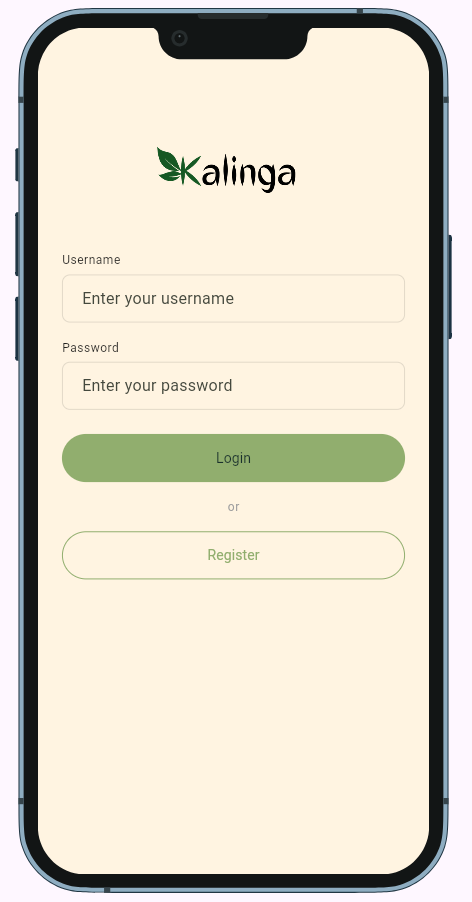
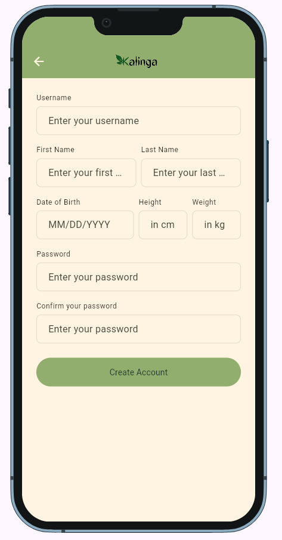
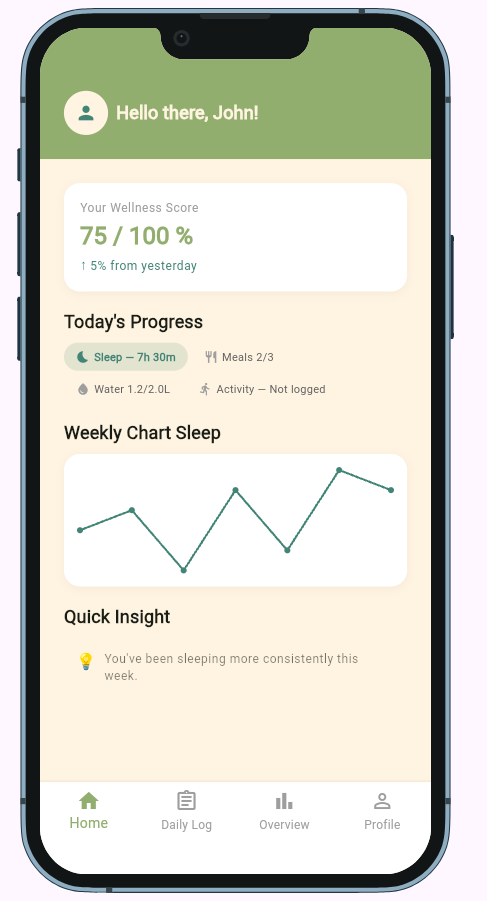
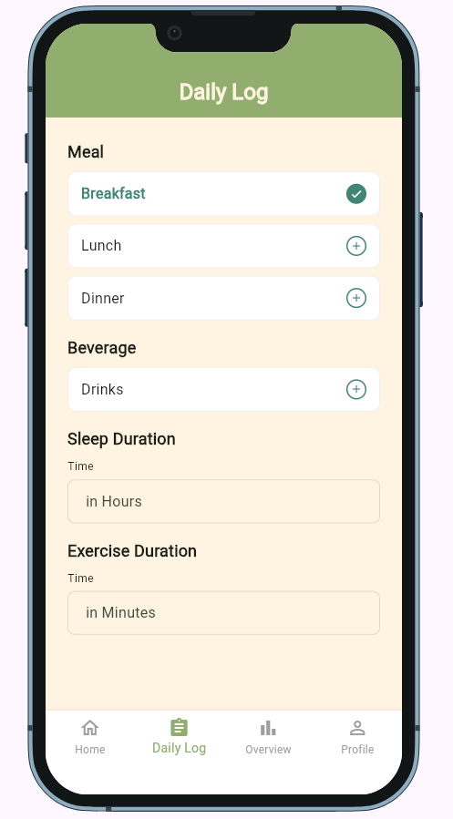
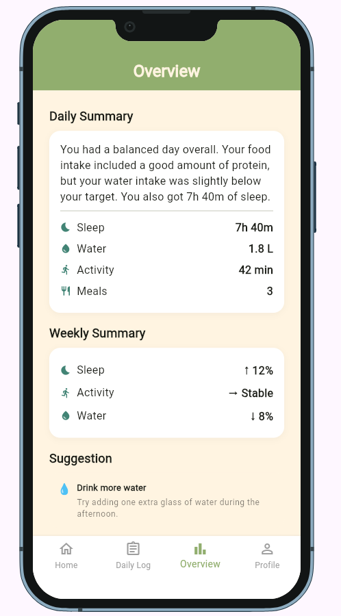
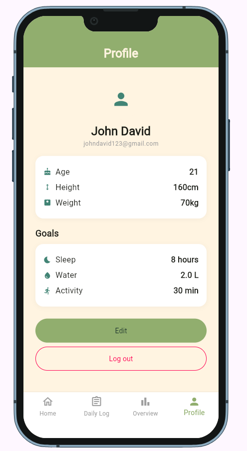

<!--
  This is your project's front page. Replace every placeholder below.
  It is the first thing your instructor and any future employer will read, and
  the live link in it is how your project gets opened for grading.

  New here? Read START-HERE.md first. Delete this comment when you are done.
-->

# App Name

> Kalinga is a daily lifestyle and health tracking tool that helps users monitor their meals, drinks, exercise, and sleep while using the Gemini API to provide personalized insights and recommendations for improving their everyday habits.

**Live demo:** https://Popcrastination.github.io/Kalinga/
**Demo video:** `docs/demo.mp4` (link it here once it exists)
**Course:** Applications Development and Emerging Technologies (6ADET), Holy Angel University
**Author:** Benedict G. Sangalang

This repository lives in the author's own GitHub account and is public on
purpose. There is no `student.json` here and there should not be one: see
`docs/06-security-and-privacy.md` for what a public repo means for secrets and
personal data.

---

## Screenshots

| Log-In | Register | Dashboard |
| --- | --- | --- |
|  |  |  |

| Daily Log | Overview | Profile |
| --- | --- | --- |
|  |  |  |

## What it does

Three to five bullets. What can a user actually do?

- **Sign in** with a username and password, or register a new account (name, date of birth, height, weight).\
- **See a daily wellness score**, today's progress at a glance, and a weekly sleep trend on the Dashboard.
- **Log meals**, drinks, sleep duration, and exercise duration for the day (Daily Log).
- **Review a daily summary**, weekly trends, and personalized suggestions (Overview).
- **View and edit personal info** (height, weight) and wellness goals (Profile).


## Built with

| | |
| --- | --- |
| Framework | Flutter (Dart) |
| State | `setState` only, scoped to each screen — no app-wide state solution yet. Login/Register track their own loading spinner locally; Daily Log tracks which entries are logged locally. None of this is shared across screens yet, since there's no signed-in-user concept until auth is wired in. |
| Storage | None yet — planned: Supabase (Postgres + Auth), chosen over local storage because the data is relational/dated (needs date-range queries for weekly charts) and because real password accounts need proper auth security, not because the app needs cross-device sync. See `docs/01-proposal.md` for the full reasoning. |
| Other packages | `device_preview` — wraps the app in a phone-sized frame during development (and in the deployed build) so the UI is judged at real phone proportions. `cupertino_icons` — ships with the template default; not yet actively used. |

## Running it yourself

```bash
flutter pub get
cp .env.example .env      # only if your app needs keys, see below
flutter run -d web-server --web-port 8080
```

Then open http://localhost:8080. Requires Flutter (run `flutter --version` and
put yours here).

### Environment variables

This project reads its configuration from a `.env` file that is **not** in the
repository. Copy `.env.example`, fill in your own values, and never commit the
result.

| Variable | What it is | Where to get one |
| --- | --- | --- |
| `SUPABASE_URL` | Your Supabase project URL | Supabase dashboard → Project Settings → API |
| `SUPABASE_PUBLISHABLE_KEY` | 	Your Supabase anon/publishable key | Same page as above |
| `GEMINI_API_KEY` | Gemini API key, for Daily Log's meal/drink validation | Google AI Studio |

## Privacy and secrets

Required section. Two or three honest sentences:

- What personal data this app stores, if any, and where it goes.
- Where the secrets live (`.env` locally, repository secrets in the deploy
  workflow) and what protects the data on the service side (Firestore rules,
  Supabase RLS, or "nothing leaves the device").
- Confirm that all sample data, screenshots and the video contain **no real
  personal information**.

## Project documentation

| Document | |
| --- | --- |
| [Proposal](docs/01-proposal.md) | the problem, the users, the scope |
| [Mockup and wireframes](docs/02-mockup.md) | what it looks like, and the screen flow |
| [Design system](docs/03-design-system.md) | colors, type, spacing, components |
| [Weekly reports](docs/04-weekly-reports.md) | what happened each week |
| [Demo video](docs/05-demo-video.md) | the recording and what it shows |
| [Start here](START-HERE.md) | how this repo works (delete once you have read it) |
| [Security and privacy](docs/06-security-and-privacy.md) | the checklist, filled in |

## Status and what is next

Works: Login, Register, Dashboard, Daily Log, Overview, and Profile all render and navigate correctly between each other via the bottom nav bar. Form validation works (empty fields, password mismatch, DOB format, sleep/exercise number ranges). Profile's Edit toggle switches between read-only and editable Height/Weight fields.

Half-done / stubbed: Every screen uses local, hardcoded, or in-memory placeholder data — nothing persists. Tapping a meal in Daily Log or Save in Profile only updates local widget state; refreshing the page loses it. Auth doesn't actually authenticate anything (Login/Register just navigate to Dashboard after a fake delay).

Known issues: the four main screens each duplicate the same bottom-nav routing logic — should be refactored into one shared shell/IndexedStack rather than four separate Scaffolds once the backend pass starts touching this code anyway. There's no way to actually log out of anything real, since there's nothing real to be logged into yet.

Next: wire up Supabase (auth + the six tables described in docs/01-proposal.md), replace Daily Log's placeholder entry sheet with real Gemini validation behind a proxy, and compute the wellness score / weekly trend percentages for real instead of hardcoding them.

## Credits

- Packages: see `pubspec.yaml`
- Logo: [Canva](https://www.canva.com/)
- Color Palette: [Coolors](https://coolors.co/)

## AI use

This project was developed with partial AI assistance (Claude) throughout the development process, including support with drafting and revising the proposal, implementing and refining parts of the code, and writing portions of the documentation. The design system, including the palette, typography, spacing, and components, as well as the Figma mockup, were independently designed and developed by the author.

A link to [AI-USAGE.md](AI-USAGE.md), where the full account lives


## Licence

MIT, see [LICENSE](LICENSE).
